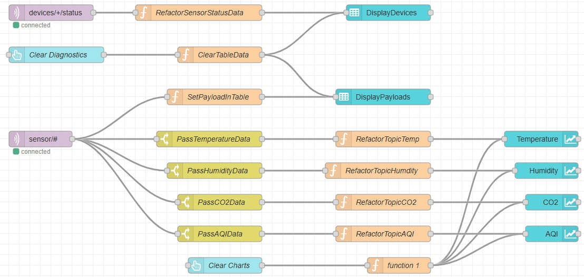
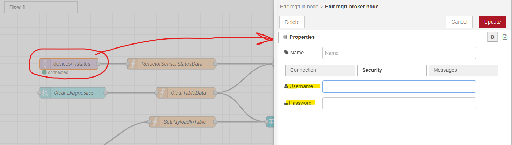

# Project Summary
* This project uses the _Raspberry Pi Zero 2 W_ Single-Board computer (SBC) and the _SCD4x_ sensor.
* SCD4x or BME688 (either one is supported) sensor data is collected (tempareature, humidity and CO2 or AQI) via the I2C interface approx. every 5 secs.
* Data is then sent to an MQTT broker (HIVEMQ) and data can be visualized using _Node-RED_ which is running on a server VM.
* Data is also stored in an _SQLite_ database stored on the _Raspberry pi Zero 2 W_.
* IoT device code is developped using Python with various 3rd party packages.
* Data collection and visualization is developed using Node-RED. 

# References
* HIVEMQ : https://www.hivemq.com/
    * Created a free account with _HIVEMQ_ for this project. Good enough for low data throughput projects with very little IoT devices.
* Node-RED : https://nodered.org/
    * Running on a VM as a Cloud service. Connects to the MQTT broker and allows for data visualization.
    * See image below for reference of Node-RED configurations:
      
* Raspberry Pi Zero 2 W : https://www.raspberrypi.com/products/raspberry-pi-zero-2-w/
    * Low powered SBC, equipped with WiFi allowing for networking capabilities and interfacing with various devices trhough GPIOs, I2C and SPI buses 
* SCD4x sensor : https://sensirion.com/media/documents/48C4B7FB/64C134E7/Sensirion_SCD4x_Datasheet.pdf
    * Single sensor capable of measuring temperature, humidity and CO2

# Create a systemd service file
* Create a new file called, for example, my_project.service:
```
sudo nano /etc/systemd/system/my_project.service
```
* Paste the following in the my_project.service

```
[Unit]
Description=My Python Project
After=network.target

[Service]
Type=simple
WorkingDirectory=/dir/to/my_project
ExecStart=/dir/to/my_project/start.sh
Restart=always
User=pi
Environment=PYTHONUNBUFFERED=1

[Install]
WantedBy=multi-user.target
```
# Enable the service
* Tell systemd to start your service at boot:
```
sudo systemctl daemon-reload
sudo systemctl enable my_project.service
```

# Check for errors after boot
* After reboot, check the service status:
```
sudo systemctl status my_project.service
```
or
```
journalctl -u my_project.service -b -f
```

# Make sure systemd can execute the script
* Your start.sh must be executable:
```
chmod +x /home/pi/my_project/start.sh
```

# Disable auto-start at boot
* If you want to prevent it from starting automatically on future reboots, run:
```
sudo systemctl disable my_project.service
sudo systemctl stop my_project.service
```
* If you change your mind and want it to auto-start again:
```
sudo systemctl enable my_project.service
```

# Prepare Node-RED flow on new system
* Clone github repo
* Run npm command inside the _nodeFlow_ folder:
```
npm install --save --legacy-peer-deps
```
* Run Node-RED flow inside the _nodeFlow_ folder:
```
node-red --userDir ~/Projects/AtmosphericSensing/nodeFlow
```
* Must manually enter the MQTT credentials in the _MQTT_IN_ node if its the 1st time running flow on system:
 
* Re-deploy the modified flow with your newly entered credentials. The flow should now be able to connect to your MQTT broker.